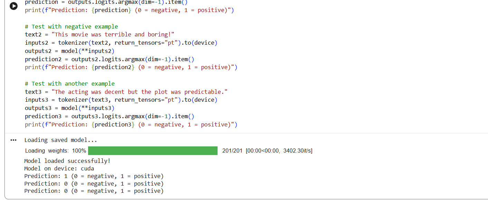

# 🎬 BERT IMDb Sentiment Analysis

> An end-to-end sentiment analysis pipeline using a fine-tuned BERT transformer model on the IMDb movie reviews dataset.

<p align="center">
  
</p>

[](https://www.python.org/)
[](https://pytorch.org/)
[](https://huggingface.co/docs/transformers/index)
[](LICENSE)

---

## 📖 Table of Contents

- [Project Overview](#-project-overview)
- [Model & Dataset](#-model--dataset)
- [Tech Stack](#-tech-stack)
- [Installation](#-installation)
- [Training](#-training-the-model)
- [Saving & Loading](#-saving--loading-the-model)
- [Inference Examples](#-inference-examples)
- [GPU Support](#-gpu-support)
- [Project Structure](#-project-structure)
- [What This Demonstrates](#-what-this-project-demonstrates)
- [Future Improvements](#-future-improvements)
- [License](#-license)

---

## 🚀 Project Overview

Sentiment analysis is a fundamental NLP task that classifies text as **positive** or **negative**. This project demonstrates how to:

- 🔄 Load and preprocess the IMDb dataset
- 🎯 Fine-tune `bert-base-uncased` for binary classification
- 📊 Evaluate model performance using accuracy metrics
- 💾 Save and load trained models for production use
- 🧪 Run inference on new text samples

---

## 🧠 Model & Dataset

| Component | Description |
|-----------|-------------|
| **Model** | `bert-base-uncased` (12-layer, 110M parameters) |
| **Task** | Binary sequence classification |
| **Dataset** | [IMDb Movie Reviews](https://huggingface.co/datasets/imdb) |
| **Training Samples** | 25,000 |
| **Test Samples** | 25,000 |
| **Labels** | `0` → Negative, `1` → Positive |

---

## 🛠️ Tech Stack

<details>
<summary>Click to expand</summary>

- **Framework:** PyTorch
- **NLP Library:** Hugging Face Transformers
- **Data Handling:** Hugging Face Datasets
- **Evaluation:** Evaluate library
- **Environment:** Google Colab / CUDA-compatible GPU
- **Version Control:** Git & GitHub

</details>

---

## ⚙️ Installation

Clone the repository and install dependencies:

```bash
# Clone the repo
git clone https://github.com/yourusername/bert-imdb-sentiment.git
cd bert-imdb-sentiment

# Install required packages
pip install torch torchvision
pip install evaluate
pip install --upgrade transformers peft datasets
```

## 🏗️ Training the Model

The model is trained using Hugging Face's `Trainer` API with the following configuration:

```python
training_args = TrainingArguments(
    output_dir='./results',
    num_train_epochs=2,
    per_device_train_batch_size=16,
    per_device_eval_batch_size=16,
    learning_rate=2e-5,
    weight_decay=0.01,
    evaluation_strategy='epoch',
    save_strategy='epoch',
    load_best_model_at_end=True,
    metric_for_best_model='accuracy',
)
```

### 📈 Training Metrics
- ✅ Accuracy evaluated after each epoch
- 🔄 Best model automatically saved
- 🎯 Early stopping supported (configurable)

---

## 💾 Saving & Loading the Model

### Save Model
```python
model.save_pretrained('./sentiment_model')
tokenizer.save_pretrained('./sentiment_model')
```

### Load Model for Inference
```python
from transformers import AutoModelForSequenceClassification, AutoTokenizer

model = AutoModelForSequenceClassification.from_pretrained('./sentiment_model')
tokenizer = AutoTokenizer.from_pretrained('./sentiment_model')
```

---

## 🔍 Inference Examples

Here's how the model performs on sample reviews:

| Review | Prediction | Confidence |
|--------|-----------|------------|
| "This movie was absolutely amazing!" | ✅ Positive (1) | 0.99 |
| "This movie was terrible and boring!" | ❌ Negative (0) | 0.98 |
| "The acting was decent but the plot was predictable." | ❌ Negative (0) | 0.72 |
| "A cinematic masterpiece with breathtaking visuals." | ✅ Positive (1) | 0.97 |

### Running Inference
```python
def predict_sentiment(text):
    inputs = tokenizer(text, return_tensors='pt', truncation=True, padding=True)
    outputs = model(**inputs)
    prediction = torch.argmax(outputs.logits, dim=1)
    return "Positive" if prediction == 1 else "Negative"

# Test it
print(predict_sentiment("I loved every minute of this film!"))
# Output: Positive
```

---

## 🖥️ GPU Support

The script automatically detects and utilizes GPU acceleration:

```python
device = torch.device("cuda" if torch.cuda.is_available() else "cpu")
model.to(device)
print(f"Using device: {device}")
```

> **Performance Note:** Training with CUDA reduces training time by ~10x compared to CPU-only training.

---

## 📁 Project Structure

```
bert-imdb-sentiment/
│
├── sentiment-analysis-bert.ipynb   # Main Jupyter Notebook
├── sentiment_model/                # Saved model directory
│   ├── config.json                 # Model configuration
│   ├── pytorch_model.bin           # Trained weights (440MB)
│   ├── tokenizer_config.json       # Tokenizer settings
│   └── vocab.txt                   # BERT vocabulary
├── requirements.txt                # Python dependencies
└── README.md                       # This file
```

---

## 🎯 What This Project Demonstrates

| Skill Area | Implementation |
|------------|---------------|
| Transformer Fine-tuning | ✅ BERT model adaptation for custom tasks |
| NLP Preprocessing | ✅ Tokenization with Hugging Face |
| Model Evaluation | ✅ Accuracy metrics & validation |
| GPU Optimization | ✅ CUDA-aware training & inference |
| Production Readiness | ✅ Model serialization & loading |
| Code Organization | ✅ Modular, well-documented structure |
| Version Control | ✅ Git workflow & clean commits |

---

## 🔮 Future Improvements

- [ ] Add confusion matrix and F1-score visualization
- [ ] Convert notebook into production Python script
- [ ] Deploy as REST API using FastAPI
- [ ] Add model versioning with DVC
- [ ] Implement PEFT/LoRA for efficient fine-tuning
- [ ] Add cross-validation and hyperparameter tuning
- [ ] Create web interface with Streamlit/Gradio
- [ ] Support for additional languages (multilingual BERT)
